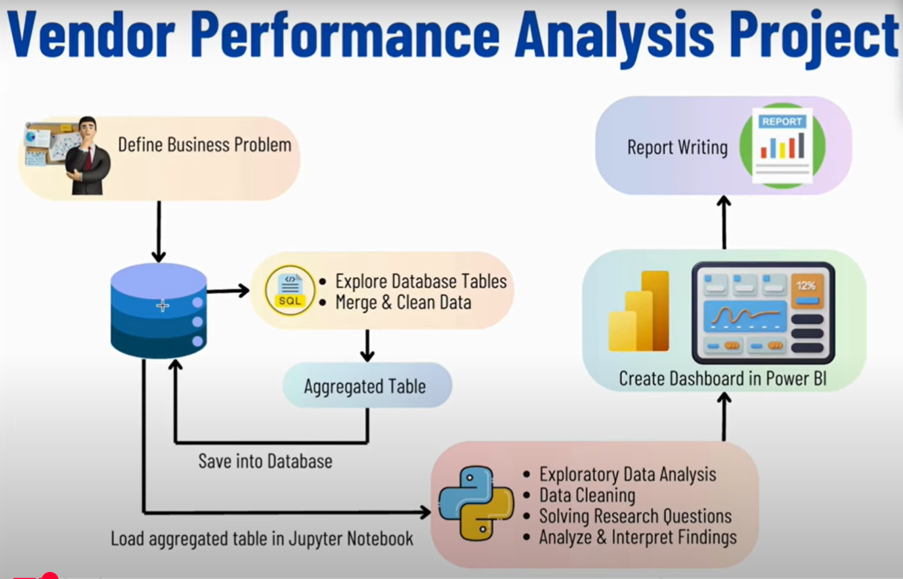

# 📊 Vendor Performance Data Analytics

This project focuses on uncovering key insights from vendor sales and inventory data to support data-driven decision-making in retail and wholesale businesses. It addresses critical business problems such as profitability variance, inventory turnover, vendor contribution, and pricing efficiency.

## 🚀 Project Objective

To analyze vendor performance and provide actionable insights to help:

- Improve **inventory turnover**
- Enhance **pricing strategies**
- Identify **top-performing and underperforming vendors**
- Optimize **bulk purchase decisions**
- Increase **gross profit margins**

---

## 🧩 Business Problem

In the retail and wholesale sector, **ineffective inventory and sales management** can lead to substantial losses. This project addresses these challenges by answering the following:

- 🧠 **Investigate** the profitability variance between high-performing and low-performing vendors
- 🔎 **Identify** underperforming brands needing promotional or pricing adjustments
- 🏆 **Determine** top vendors contributing to sales and gross profit
- 📉 **Analyze** the impact of bulk purchasing on unit cost
- 📦 **Assess** inventory turnover to reduce holding costs and improve efficiency

---

## 📈 Workflow Diagram

 <sub>📌 Replace the above path with your actual image path or URL.</sub>

---

## 🛠️ Tools & Technologies Used

- **Python** (Pandas, NumPy, Matplotlib, Seaborn)
- **Jupyter Notebook**
- **SQL** (for data extraction and transformation)
- **Excel** (for raw data handling and sharing)
- **Power BI / Tableau** _(optional for dashboards)_

---

## 🔍 Key Insights Derived

- ⚖️ Identified significant profit variance between vendors
- 📉 Detected underperforming brands with low ROI
- 📊 Ranked vendors based on revenue and gross profit contribution
- 📦 Assessed bulk purchasing benefits on reducing unit cost
- 🔁 Evaluated inventory turnover to recommend holding cost optimizations

---

## 📝 How to Use

1. Clone this repository

   ```bash
   git clone https://github.com/yourusername/vendor-performance-analytics.git
   ```

2. Navigate to the project directory

   ```bash
   cd vendor-performance-analytics
   ```

3. Open the Jupyter Notebook or Python script and start the analysis

   ```bash
   jupyter notebook
   ```

---

## 📌 Resume Highlight (for use in your resume)

> **Vendor Performance Data Analytics** – Conducted in-depth analysis of retail vendor data to optimize sales strategy, improve inventory turnover, and enhance profitability by identifying key contributors and loss-making segments.

---
